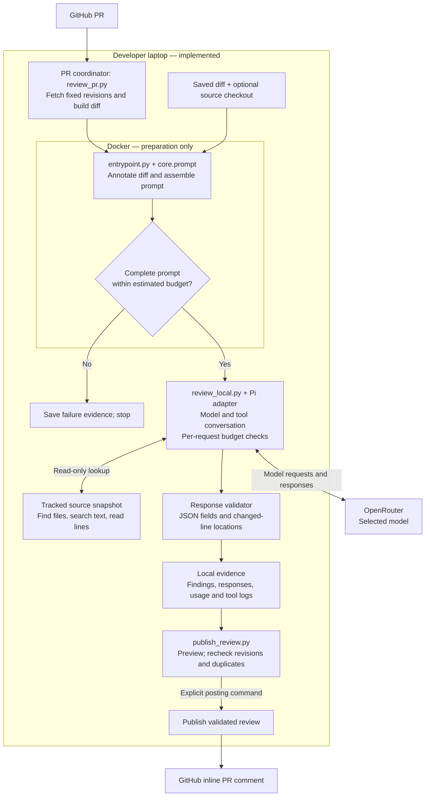

# Architecture drift review

## Objective and approach

Build a self-hosted PR reviewer that prioritizes project architecture guidelines while allowing other supported correctness findings. Assemble an annotated diff and review instructions, enforce estimated context budgets, let Pi coordinate model review and read-only repository lookup, validate the response, and publish supported findings to changed PR lines.

## Current results

- **Local PR review:** we reviewed an Android test PR and posted the finding on the correct code line. [Posted test comment](https://github.com/abhinavkumar17/nowinandroid/pull/1#discussion_r4117992844).
- **Review testing progressed from small changes to a larger comparison.** We started with a two-file Android change to check whether the reviewer could identify a deliberate architecture violation. We then tested a five-file settings change with repository lookup, before moving to a fifteen-file change containing several deliberate issues. Each stage answered a different question:

  | Test | Why we ran it | What we learned |
  | --- | --- | --- |
  | Two-file architecture change | Check whether the reviewer identifies the screen directly changing ViewModel-owned state. | It reported the violation. A manual reverse/fix test returned no findings. |
  | Five-file settings change | Check whether the reviewer detects direct datastore access and can inspect related repository code. | Both the diff-only and lookup-enabled reviews found the repository bypass. The lookup run searched and read supporting files; this demonstrated tool use, not an accuracy improvement over the diff-only run. |
  | Blocking-code and valid-change cases | Check whether the reviewer can report a real bug outside the written architecture rules and leave a valid change unflagged. | Broader review instructions allowed the blocking bug to be reported. Valid-change responses returned no findings, but some responses failed the original strict JSON parser. That led to the separate response-format fix described below. |
  | Fifteen-file Android change | Compare models on the same larger input, with architecture violations, correctness bugs, and supporting changes. | Claude Sonnet 4.6, OpenAI GPT 5.5, and Gemini 2.5 Pro each found the four intended issue categories. Their suggested fixes, overlapping findings, repository tool use, token usage, and costs differed. |

  The fifteen-file comparison ran through OpenRouter using the same prompt, source snapshot, and review limits. Expected answers were kept out of the model inputs. The Android changes were not compiled or executed before review. The earlier stages were separate experiments; this table does not imply that every earlier case was run with all three models under identical conditions.

  The **approximately $0.413 USD** recorded cost covers only the three reviews of the fifteen-file change, not all testing to date. See the [comparison report and original responses](evidence/model-comparison/README.md) for findings, costs, tokens, and tool activity. The milestone sections below explain each stage and link its available evidence.
- **Prompt assembly and token-limit checks:** before calling the model, we combine the review instructions, architecture guidelines, annotated code changes, and expected response format into one complete prompt. We estimate its token count and compare it with the configured input limit. If the prompt is too large, we save the preparation result and stop without calling the model. We tested both an input that fits and an oversized input that is correctly stopped. See the [assembled prompt](evidence/prompt-test/pr.diff.prompt.txt), [token estimate report](evidence/prompt-test/pr.diff.report.json), and [oversized Docker test](evidence/live-docker-test/twenty-commits/summary.json).

  During a repository-aware review, the model can ask to search or read supporting files. The returned excerpts become part of the next request, along with the existing review context. We therefore check the estimated input size again before each model call and stop if it exceeds the limit. These are token-size limits, not spending limits; token counts are currently estimated from character counts rather than measured with the model's tokenizer.
- No AWS/Fargate setup

## Local flow

The local PR-to-comment path has been demonstrated. Preparation runs in Docker; Pi and the publisher run on the laptop. OpenRouter supplies the selected model remotely.

## Development milestones: why, tests, and evidence

### 1. Acquire a reproducible diff

**What we did:** first used saved Alamofire diffs, then verified live repository fetching in Docker. The later local PR coordinator fetches fixed base/head commits into a separate checkout, derives the diff from their merge base, and records the revisions. It checks for revision changes before treating a review as current.

**Result and proof:** saved inputs make the early experiments repeatable; live preparation demonstrated repository-to-diff acquisition. See the [small saved diff](evidence/annotation-test/pr.diff), [large saved diff](evidence/annotation-test/pr-20.diff), and [live five-commit run](evidence/live-docker-test/five-commits/summary.json). Private-repository and unattended cloud authentication remain pending.

### 2. Annotate changes and validate comment locations

**Why:** a raw diff has hunk coordinates, but a model needs an explicit file, line, and side for each finding. Deleted lines use old-file numbering; added lines use new-file numbering. Mixing these can put a valid observation on the wrong line.

**What we did:** annotation labels added, deleted, and context lines and builds a side-aware allow-list. Production Swift/Kotlin files are commentable; other files remain readable context under the current policy. Validation rejects findings outside allowed changed lines. Annotation provides addresses; it is not intended to compress the diff.

**Tests and result:** synthetic annotation tests exercise numbering and allowed locations. The historical investigation found an earlier hunk-based guard rejected 11 of 16 deleted lines and incorrectly accepted 11 context lines; deriving the allow-list from annotated lines corrected that mismatch. Saved Alamofire runs exercise the same approach on larger diffs.

**Proof:** [annotation output](evidence/annotation-test/annotation-run.txt), [large annotation output](evidence/annotation-test/annotation-run-20.txt), [historical test output](evidence/annotation-test/test-run.txt), and [annotation tests](tests/test_annotate.py). The saved test log is a historical snapshot, not the current full-suite result.

### 3. Explore diff budgets, then check the complete prompt

**Why:** counting only the diff misses instructions, guidelines, and output requirements. We needed evidence that the final assembled input is checked before a model is called.

**First experiment — diff-only packing:** the packer kept file blocks until an 800,000-token estimated allowance was reached. The small saved run kept 161,335 estimated tokens; the large run kept 799,214 and excluded 48 files. This demonstrated size enforcement, but could omit review context. [Small packing log](evidence/annotation-test/pack-run.txt), [large packing log](evidence/annotation-test/pack-run-20.txt).

**Current approach — assemble first, then gate:** insert guidelines and all annotated diff blocks into the template, estimate the complete prompt, and stop if it exceeds the configured allowance. The complete-prompt path does not trim files to make the input fit.

| Historical complete-prompt test | Estimated input tokens | Allowance | Result |
| --- | ---: | ---: | --- |
| Small saved diff | 164,870 | 800,000 | Fits |
| Large saved diff | 1,449,353 | 800,000 | Correctly rejected as oversized |

**Proof:** [small assembled prompt](evidence/prompt-test/pr.diff.prompt.txt), [small report](evidence/prompt-test/pr.diff.report.json), [large assembled prompt](evidence/prompt-test/pr-20.diff.prompt.txt), and [large report](evidence/prompt-test/pr-20.diff.report.json). Reports include input fingerprints. The large case passed its expected-overflow test; it did not pass for submission to a model.

**Limit:** these historical allowances are experiment settings, not current model limits. All these checks use character count divided by three, rounded up. They prove the gate's behavior, not exact tokenizer-level context fit or a spending cap.

### 4. Automate preparation and verify it in Docker

**Why:** preparation needed one repeatable command, consistent failure handling, and saved evidence rather than manual steps.

**What we tested:** the runner executes preparation tests, acquires or reads a diff, annotates it, assembles the prompt, and records the budget outcome. Later stages stop on failure. Both saved-input and live-fetch Docker runs were exercised.

**Result:** historical Docker validation passed all 27 preparation tests. The live five-commit input fit at 164,857 estimated tokens; the twenty-commit input stopped at 1,449,340 against an 800,000 allowance. No model was called and no files were trimmed. Slight differences from the earlier prompt snapshot reflect separate runs and template versions.

**Proof:** [five-commit summary](evidence/live-docker-test/five-commits/summary.json), [twenty-commit summary](evidence/live-docker-test/twenty-commits/summary.json), and their [saved evidence folders](evidence/live-docker-test). Application test success does not mean the reviewed Android code is defect-free.

### 5. Integrate Pi and controlled repository lookup locally

**Why:** a diff may reveal a suspicious dependency without showing its consequences. The reviewer needs a way to inspect related code while controlling context growth and recording its activity.

**What we did:** the local coordinator starts Pi after preparation passes. Repository-aware review uses read-only file discovery, text search, and line-reading tools over a tracked-source snapshot. Our adapter limits tool work, estimates each request's context, and records usage. Pi manages the model/tool conversation. These are application controls, not an operating-system sandbox.

**Tests and result:** a small Android state-ownership violation produced a finding; a manual reverse/fix case produced none. A five-file settings-reset experiment detected direct datastore access bypassing a repository in both diff-only and lookup-enabled reviews. The lookup run made three searches, three reads, and three model requests, totaling 17,008 reported tokens including repeated/cached context. This demonstrated lookup, not an accuracy improvement over the baseline.

**Proof:** the [original milestone and per-request table](README-history.md#local-review-milestone--september-27-2026) preserve the earlier results and local artifact location. The newer [three-model checkpoint](evidence/model-comparison/README.md) attaches repository-aware findings and usage directly to the repo. Earlier generated run folders remain local and are not presented as downloadable evidence.

### 6. Broaden review scope and make response handling reliable

**Why:** architecture guidelines should guide attention without suppressing genuine correctness defects. Separately, useful findings should not be lost merely because a model wraps JSON in Markdown.

**What we tested:** the original architecture-focused instructions missed a synthetic blocking-code problem; broader instructions detected it. We aligned the template and Pi adapter, then checked architecture violation, blocking defect, and valid-change cases. Models detected the intended defects, but several responses failed the old raw-JSON-only parser.

**Change and result:** the parser now accepts a single unambiguous JSON object surrounded by prose or Markdown, while rejecting malformed or ambiguous responses and still validating fields and locations. The template requests JSON only. The previous offline verification reported 87 passing Python tests and successful parsing/location checks for all nine saved responses; no new model calls were needed for that fix. This documentation edit does not rerun those tests.

**Proof and limit:** format tests (local, not yet published), publisher tests (local, not yet published), and [new comparison responses and validation results](evidence/model-comparison/README.md). The earlier three-case response sets remain local. Parser acceptance is distinct from whether a suggested fix is correct.

### 7. Complete the local PR-to-comment loop

**Why:** producing a finding locally is only part of the goal; it must reach the intended changed line on the reviewed PR without being stale or duplicated.

**What we did:** the PR coordinator records exact revisions. The publisher creates a preview, checks current revisions, submits against the reviewed commit, and records publication. An existing-review marker and a local submission journal help prevent duplicate posting.

**Result and proof:** the five-file Android test produced an [inline comment on the intended ViewModel line](https://github.com/abhinavkumar17/nowinandroid/pull/1#discussion_r4117992844). Repeat-posting verification is pending. See PR coordinator tests (local, not yet published) and publisher tests (local, not yet published). Cloud concurrency and durable duplicate tracking still need work; the local demonstration does not establish production-safe distributed posting.

### 8. Compare models on a larger unchanged fixture — latest checkpoint

**Why:** small examples did not show enough about differences in evidence gathering, suggestion quality, cost, and token use.

**What we tested:** the same fifteen-file Android diff, prompt, source snapshot, and limits were given independently to Claude Sonnet 4.6, OpenAI GPT 5.5, and Gemini 2.5 Pro through OpenRouter. The fixture includes two architecture categories, two correctness categories, and supporting changes. Expected answers were excluded from model inputs. At the user's request, the Android fixture was not built or repaired first.

**Result:** all three found the four intended categories. Claude returned five findings with an overlap; OpenAI returned four and checked the analytics consequence; Gemini returned four without tool use but proposed some incorrect fixes. Total recorded cost was about $0.413 USD. All responses passed the revised validation. This is a controlled comparison, not voting, and not proof of equal quality or broad accuracy.

**Proof:** [comparison tables, tokens, costs, tools, and raw findings](evidence/model-comparison/README.md), [exact prompt](evidence/model-comparison/prompt.txt), and [fixture diff](evidence/model-comparison/input.diff). Review experiments stop here pending Pratik's input.

### 9. Move the verified local workflow to Fargate — next target

**Why:** the eventual review should run without a developer's laptop or interactive sign-in. Fargate is the selected target for an on-demand container worker.

**Still pending:** packaging Pi and publication with preparation, unattended GitHub App/OpenRouter authentication, a manual end-to-end Fargate run, and then automatic event triggering.

## Review this checkpoint

1. Inspect the [model comparison and linked raw findings](evidence/model-comparison/README.md).
2. Inspect the [assembled prompt](evidence/model-comparison/prompt.txt) and [fixture diff](evidence/model-comparison/input.diff).
3. Check historical assembly evidence: [complete prompt](evidence/prompt-test/pr.diff.prompt.txt), [budget report](evidence/prompt-test/pr.diff.report.json), and [oversized Docker summary](evidence/live-docker-test/twenty-commits/summary.json).
4. Inspect the [published local test comment](https://github.com/abhinavkumar17/nowinandroid/pull/1#discussion_r4117992844).

Older implementation explanations and experiments are preserved in [development history](README-history.md); their status statements are historical.

## Pending work and AWS sequence

- [ ] Verify repeat posting: repeat the posting step using the same saved review and confirm that no duplicate PR comment is created. Save the result as evidence.
